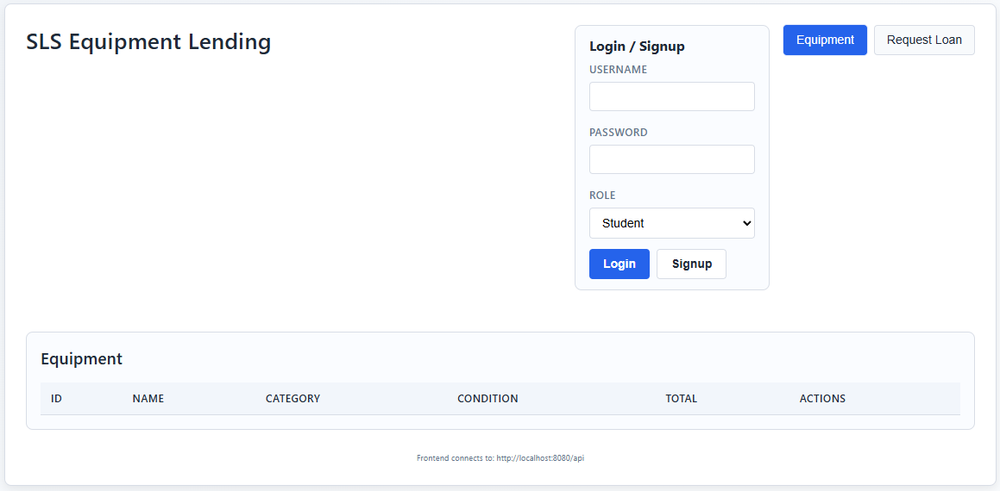
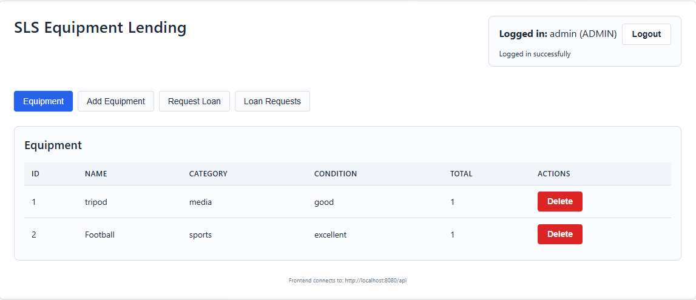
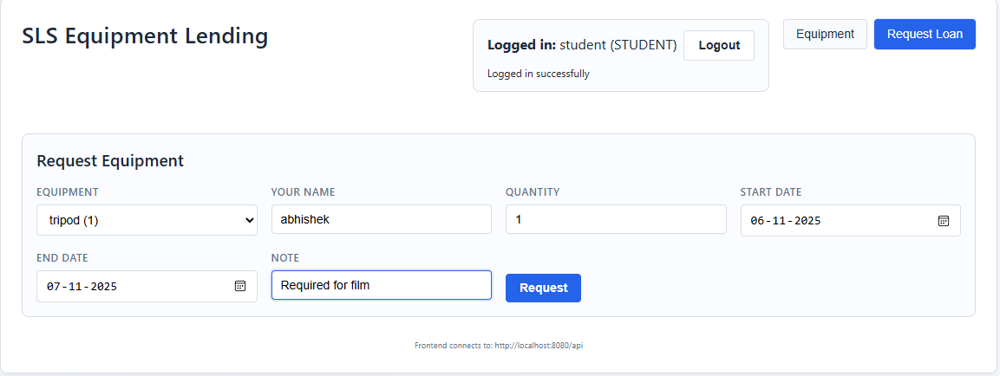
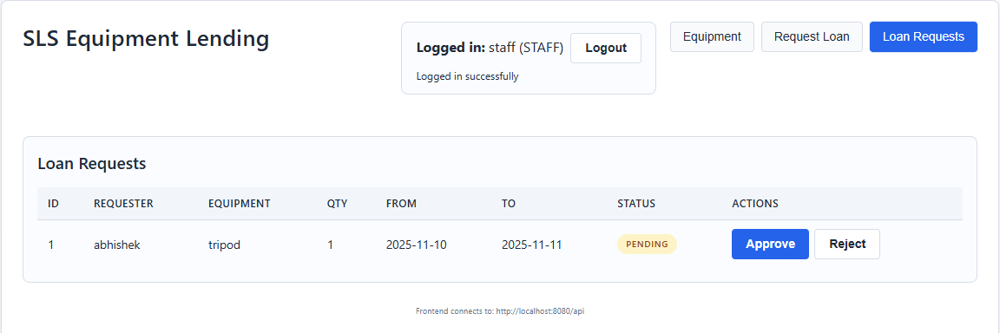

# 🏫 School Equipment Lending System (SLS)

## 📘 Project Overview
The **School Equipment Lending System (SLS)** is a full-stack web application that allows schools to manage and track the borrowing of shared equipment such as lab instruments, sports kits, cameras, and musical instruments.

This project was developed as part of a college assignment to:
1. Build the system **manually (Phase 1)**, and  
2. Enhance and refactor it using **AI-assisted tools (Phase 2)** such as GitHub Copilot and ChatGPT.

---

## ⚙️ Tech Stack

| Layer | Technology |
|--------|-------------|
| **Frontend** | React (Vite) |
| **Backend** | Java Spring Boot 3.5.7 |
| **Database** | H2 (in-memory) |
| **Build Tool** | Maven |
| **Documentation** | Postman Collection |
| **AI Tools (Phase 2)** | GitHub Copilot, VSCode IDE |

---

## 🧩 Features

### ✅ Core Functionalities
- **User Roles:** Student, Staff, and Admin  
- **Authentication:** Simple token-based login/signup (simulated)  
- **Equipment Management (Admin):** Add, update, delete, and list equipment  
- **Borrowing Requests:** Students can request to borrow equipment  
- **Approval Flow:** Staff/Admin can approve, reject, or mark items as returned  
- **Role-Based Access:** UI adapts based on logged-in user’s role  

---

## 🏗️ Local Setup Guide

### 🧰 Prerequisites
Make sure you have:
- **Java 17+**
- **Node.js 18+**
- **Maven 3.9+**
- **Git**
- (Optional) Postman for API testing

---

### 🧱 1. Clone the Repository
```bash
git clone https://github.com/IonMind/ACEest_Fitness_Py.git
cd ACEest_Fitness_Py
```
*(replace with your actual repository name if different)*

---

### ⚙️ 2. Backend Setup (Spring Boot)
#### Navigate to the backend folder:
```bash
cd sls_backend
```

#### Build and run using Maven:
```bash
mvn clean install
mvn spring-boot:run
```

#### Backend runs at:
```
http://localhost:8080
```

---

### 💻 3. Frontend Setup (React + Vite)
#### Navigate to the frontend folder:
```bash
cd ../sls_frontend
```

#### Install dependencies:
```bash
npm install
```

#### Start the development server:
```bash
npm run dev
```

#### Frontend runs at:
```
http://localhost:5173
```

---

## 🔐 Authentication & Roles

| Role | Capabilities |
|------|---------------|
| **Admin** | Add / Update / Delete equipment, Approve / Reject loans |
| **Staff** | Approve / Reject / Mark return of equipment |
| **Student** | Request equipment, View available items |


NOTE: Tokens returned after login must be added as a header:
```
X-Auth-Token: <your-token>
```

---

## 🧠 Application Workflow

### 🧩 Step 1 — Authentication
Users (student, staff, admin) can sign up and log in.  
Upon login, a token is generated and stored in browser localStorage.

### 🧩 Step 2 — Equipment Management (Admin)
Admins can:
- Add new equipment  
- Edit or delete items  
- View all equipment and total quantity  

### 🧩 Step 3 — Loan Request (Student/Staff)
Students or staff can:
- Request items for a date range  
- Check current availability (Phase 2)  
- View loan request status

### 🧩 Step 4 — Approval Workflow
Staff/Admin:
- Approve or reject pending requests  
- Mark items as returned after due date  

---

## 🔍 Testing with Postman
Try it! 
[Postman Collection](https://documenter.getpostman.com/view/4932169/2sB3WtrJiC) 

---

## 📋 Folder Structure

```
sls_backend/
 ├── src/main/java/com/ionmind/sls_backend/
 │   ├── controller/
 │   ├── model/
 │   ├── repository/
 │   ├── service/
 │   └── config/
 ├── pom.xml
 └── README.md

sls_frontend/
 ├── src/
 │   ├── components/
 │   ├── api.js
 │   ├── App.jsx
 │   └── main.jsx
 ├── vite.config.js
 └── package.json
```

---

## 🧩 Sample Screenshots









---

## 🧑‍💻 Author
**Abhishek Chaudhary**  
📧 2024tm93240@wilp.bits-pilani.ac.in

